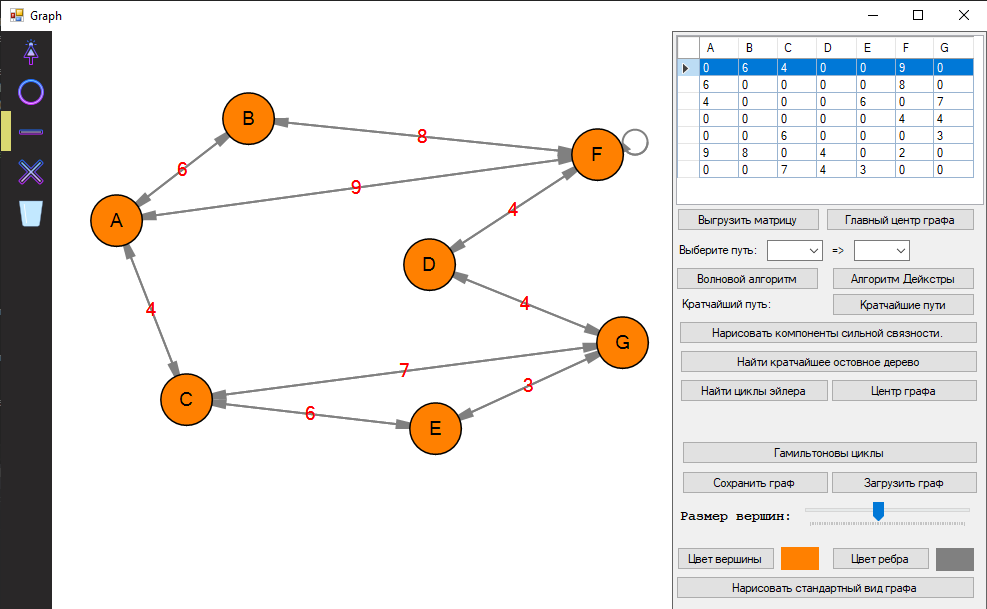

### Иллюстрация программы ###

Данная программа предназначена для работы с графами и просмотра работы простых алгоритмов с ними.
## Реализованные алгоритмы: ##
 - Алгоритм Дейкстры
 - Волновой алгоритм
 - Алгоритм нахождения сильных компонент связности
 - Алгоритм MST Прима
 - Алгоритм Флёри (нахождение циклов Эйлера)
 - Алгоритм нахождения центра Графа
 - Алгоритм нахождения Гамильтоновых циклов

## Алгоритмы, которые будут реализованы в будущем: ##
 - Алгоритм Беллмана-Форда
 - Алгоритм Флойда-Уоршела
 - Алгоритмы поиска SST (минимального остовного дерева) 
   * Алгоритм Краскала
 - Алгоритм нахождения Гамильтоновых маршрутов
 - Алгоритм нахождения цикломатической матрицы
 
>По графу, который строит пользователь создаётся матрица смежности. 
>В будущем будет добавлена матрица инцедентности.

## Возможности: ##
 - Перемещение вершин по экрану
 - Добавление/Удаление вершины
 - Добавление ребра и веса
 - Очистка экрана
 - Изменение цвета/размера вершин/рёбер
 - Нарисовать стандартный вид графа
 - Сохранить граф
 - Загрузить граф
 - Выгрузка кратчайших путей всех путей

## Установка ##
Чтобы установить данную программу, достаточно скачать папку *"GraphSetup"* и запустить файл *"setup.exe"*.

